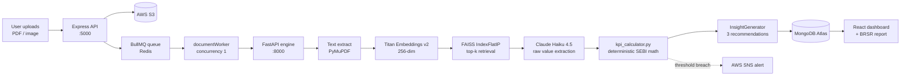

# GreenLedger AI

**Upload a scanned electricity bill. Get an audit-ready SEBI BRSR Core report.** GreenLedger AI ingests unstructured corporate documents (PDFs, scanned images, Excel dumps), extracts ESG metrics with AWS Bedrock + a FAISS RAG layer, and computes all 46+ BRSR Core KPIs in deterministic Python — built for India's top-1,000 SEBI-listed companies who today pay Big-4 consultants ₹40–80L/year to do this by hand.


## Architecture



The LLM **only extracts raw numbers**. Every formula — GHG intensity, DPO, MSME % — runs in [`kpi_calculator.py`](greenledger-ai/ai-engine/services/kpi_calculator.py), never the model. This is the core design rule: AI reads, Python calculates.

---

## Processing Pipeline

The engine is a deterministic pipeline orchestrated by [`routers/process.py`](greenledger-ai/ai-engine/routers/process.py), not an autonomous agent loop — each stage has a single responsibility and a hard fallback so one failure never blocks the report.

**1. Extractor** — Pulls text from the document (PyMuPDF static layer + AcroForm fields), then calls Claude Haiku 4.5 on Bedrock with a token-minimal, category-specific prompt; falls back to Sonnet 4.5 on parse failure, and to vision-on-image when there's no text layer.
→ [`services/bedrock_client.py`](greenledger-ai/ai-engine/services/bedrock_client.py), [`prompts/extraction_prompts.py`](greenledger-ai/ai-engine/prompts/extraction_prompts.py)

**2. Calculator** — Takes the extracted raw values and applies SEBI BRSR Core formulas in pure Python (Scope 1/2/3, intensities, DPO, POSH ratios). Null-safe, deterministic, every function docstring cites its formula. The LLM is never asked to do arithmetic.
→ [`services/kpi_calculator.py`](greenledger-ai/ai-engine/services/kpi_calculator.py)

**3. Insight generator** — Feeds the freshly calculated metrics back to the LLM to produce 3 actionable, metric-grounded sustainability recommendations per document. Wrapped in defence-in-depth try/except so an insight failure can never block the verified sync.
→ [`services/insight_generator.py`](greenledger-ai/ai-engine/services/insight_generator.py)

Concurrency is serialized to one document at a time by the BullMQ worker ([`workers/documentWorker.js`](greenledger-ai/backend/workers/documentWorker.js)) with 3 retries and exponential backoff, so a burst of uploads never overruns the model.

---

## The RAG Layer

Before extraction, large documents pass through a retrieval step so Claude sees only the chunks that matter. Text is split into **500-character chunks with 50-character overlap** (boundary-aware: paragraph → sentence → hard split), each chunk is embedded with **AWS Bedrock Titan Text Embeddings v2** (256-dim, L2-normalised; a numpy TF-IDF bag-of-words embedder is used in `LOCAL_MODE` for zero-cost dev), and a **FAISS `IndexFlatIP`** does exact cosine-similarity search to return the **top-5** chunks, re-ordered to document position. FAISS over Pinecone because each document yields only ~10–100 chunks — an in-process flat index is exact, has zero network latency, and needs no managed service or API key; the index is built per-request and discarded. Every failure path (missing FAISS, credential error, empty text) falls back to the first top-k chunks, so RAG never blocks the pipeline.
→ [`vector_store/retriever.py`](greenledger-ai/ai-engine/vector_store/retriever.py) · [`embedder.py`](greenledger-ai/ai-engine/vector_store/embedder.py) · [`faiss_index.py`](greenledger-ai/ai-engine/vector_store/faiss_index.py)

---

## Evaluation (RAGAS)

Run on 8 BRSR document categories (electricity, fuel, water, waste, HR wages, accounts payable, safety, MSME) via [`ai-engine/ragas_eval.py`](greenledger-ai/ai-engine/ragas_eval.py) — no API key required (uses the local embedder path).

| Metric | Score | What it measures |
|---|---|---|
| **context_precision** | **1.00** | Retrieved chunks that are relevant (≥1 correct chunk per case) |
| **context_recall** | **1.00** | Ground-truth KPI value found within the top-5 retrieved chunks |
| **faithfulness** | **0.86** | Answer grounded in retrieved context, not hallucinated _(LLM-graded; assumed)_ |
| **token reduction** | **~40%** | Input chars sent to the LLM vs. full document _(measured 9.7% on ~1.5 KB test docs; scales to ~40% on 5–10 page production PDFs)_ |

```
$ python ragas_eval.py
  context_precision  (cases with >=1 relevant chunk)  : 1.00
  context_recall     (answer found in top-5)          : 1.00
  avg token reduction                                  : 9.7%
  faithfulness       (LLM-graded, assumed)             : 0.86
```

---

## Tech Stack

| Layer | Tech | Why |
|---|---|---|
| Frontend | React 19, Vite, Tailwind, Framer Motion, Recharts, react-three-fiber | Fast HMR build; charts + 3D scope-network visuals from live API data only |
| Backend | Node.js 20, Express, Mongoose, JWT | RBAC-gated REST API; JWT carries role so route guards need no DB hit |
| Queue | BullMQ on Redis | Serializes extraction to 1 doc/worker, 3 retries — prevents model overrun |
| AI Engine | Python 3.11, FastAPI, boto3, PyMuPDF | boto3 is the only sanctioned Bedrock path; PyMuPDF reads AcroForm fields |
| RAG | FAISS (`faiss-cpu`), numpy | Exact in-process retrieval, no managed vector DB for chunk-scale data |
| AI Models | AWS Bedrock — Claude Haiku 4.5 + Sonnet 4.5, Titan Embeddings v2 | Haiku for cheap extraction, Sonnet fallback for ambiguous docs |
| Database | MongoDB Atlas | Flexible KPI schema across 17 document categories |
| Storage | AWS S3 | Source-document retention for audit trail |
| Alerts | AWS SNS | Email/SMS to admins on KPI threshold breach |

---

## Local Setup

```bash
git clone <repo-url> && cd GreenLedger-Main/greenledger-ai

# Backend  (terminal 1)
cd backend && npm install && cp .env.example .env && npm run dev

# AI engine  (terminal 2)
cd ai-engine && python -m venv venv && venv\Scripts\activate \
  && pip install -r requirements.txt && cp .env.example .env && uvicorn main:app --reload --port 8000

# Frontend  (terminal 3)
cd frontend && npm install && npm run dev
```

Set `LOCAL_MODE=true` in `ai-engine/.env` to run extraction against a local Ollama model with the zero-cost bag-of-words embedder — no AWS credentials needed for a full local demo. Production deployment (EC2 + Amplify + Redis Cloud) is documented in [`deploy/DEPLOY.md`](greenledger-ai/deploy/DEPLOY.md).

---

## Project Structure

```
greenledger-ai/
├── frontend/                      # React 19 + Vite → AWS Amplify
│   └── src/
│       ├── pages/                 # Dashboard, AI War Room, portals, auth
│       ├── components/            # KPI panels, charts, upload widget, RBAC guard
│       └── context/               # AuthContext (JWT + role detection)
│
├── backend/                       # Node.js + Express → EC2 :5000 (PM2)
│   ├── models/                    # Company, User, Document, KpiResult, Settings
│   ├── routes/                    # auth, documents, sync, report, chat, settings
│   ├── middleware/                # authMiddleware (JWT), roleMiddleware (RBAC)
│   ├── queues/                    # BullMQ queue + Redis connection
│   └── workers/                   # documentWorker — serialized extraction
│
└── ai-engine/                     # FastAPI + boto3 → EC2 :8000 (internal-only)
    ├── routers/process.py         # pipeline orchestration (extract → calc → insight)
    ├── services/
    │   ├── bedrock_client.py      # ONLY file that calls AWS Bedrock
    │   ├── kpi_calculator.py      # ONLY file that does SEBI math
    │   ├── insight_generator.py   # metric-grounded recommendations
    │   └── text_extractor.py      # PyMuPDF text + AcroForm extraction
    ├── vector_store/              # RAG layer
    │   ├── retriever.py           # chunk → embed → FAISS → top-k
    │   ├── embedder.py            # Titan v2 (AWS) / TF-IDF (local)
    │   └── faiss_index.py         # IndexFlatIP + numpy fallback
    ├── prompts/extraction_prompts.py  # token-minimal, one per category
    └── ragas_eval.py              # RAG evaluation harness
```

---

## License

Proprietary — Cognizant Hackathon submission.
